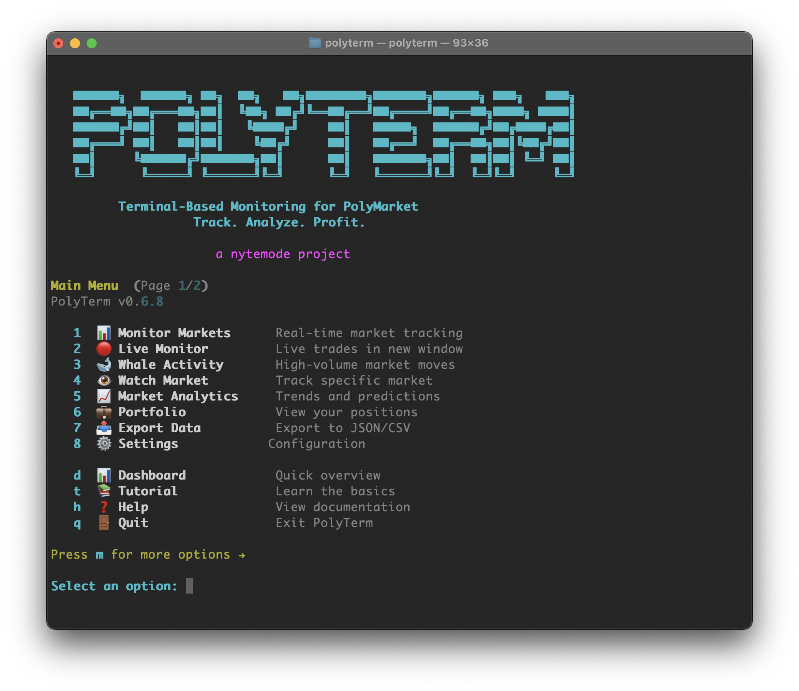

# PolyTerm

A powerful, terminal-based monitoring and analytics tool for PolyMarket prediction markets. Track market shifts, whale activity, insider patterns, arbitrage opportunities, and signal-based predictions—all from your command line.

*a [nytemode](https://nytemode.com) project*

[](https://www.python.org/downloads/)
[](https://opensource.org/licenses/MIT)
[](https://pypi.org/project/polyterm/)
[](https://github.com/sponsors/NYTEMODEONLY)

**[Full Documentation](docs/README.md)** — Comprehensive docs for every CLI command, TUI screen, API module, core engine, and agentic runtime integration.



---

## Quick Start

### Option 1: Install from PyPI (Recommended)
```bash
pipx install polyterm
```

### Option 2: One-Command Install
```bash
curl -sSL https://raw.githubusercontent.com/NYTEMODEONLY/polyterm/main/install.sh | bash
```

### Option 3: Manual Install
```bash
git clone https://github.com/NYTEMODEONLY/polyterm.git
cd polyterm
pip install -e .
```

**Launch PolyTerm:**
```bash
polyterm
```

---

## Why PolyTerm

PolyTerm is an analytics and intelligence layer for Polymarket — not just an API wrapper.

- **20+ analytics features** no other CLI has: wallet-level whale tracking, insider detection scoring, arbitrage scanning (including cross-platform vs Kalshi), signal-based multi-factor predictions, wash trade detection, UMA dispute risk analysis, and market risk grading (A-F).
- **Agent-ready tooling**: manifest, JSON Schemas, FastMCP stdio server, legacy JSON-lines adapter, doctor diagnostics, `llms.txt`, `llms-full.txt`, and read-only market/wallet/thesis tools for Hermes Agent, OpenClaw, Codex, and other automations. See [Agentic Usage](docs/AGENTIC_USAGE.md) for the operational playbook.
- **73+ interactive TUI screens** with menu navigation, contextual help, and an onboarding tutorial. No other Polymarket terminal tool has a TUI.
- **Terminal-native visualization**: ASCII line charts, sparklines, depth charts, and side-by-side market comparison — all without leaving the terminal.
- **Stateful local database** (SQLite): bookmarks, price alerts, trade journal, position tracking, recently viewed markets, screener presets. Your research accumulates value over time.
- **Zero custody risk**: PolyTerm never touches private keys. Wallet features are view-only. No attack surface for key theft.
- **CI-backed tests**: [](https://github.com/NYTEMODEONLY/polyterm/actions/workflows/ci.yml). Reproduce the collected count with `python -m pytest --collect-only -q --ignore=tests/test_live_data --ignore=tests/test_tui/test_integration.py` (this branch, 2026-08-30: **1145 collected**; changelog totals below are archival).

For a detailed comparison with the official Polymarket CLI, see [docs/COMPETITIVE_GAP.md](docs/COMPETITIVE_GAP.md).

---

## Features Overview

### Core Features
| Feature | Command | Description |
|---------|---------|-------------|
| Market Monitoring | `polyterm monitor` | Real-time market tracking with live updates |
| Live Monitor | `polyterm live-monitor` | Dedicated terminal window for focused monitoring |
| High-Volume Markets | `polyterm whales` | Gamma 24h volume heuristic (not trader identity) |
| Wallet-Level Whales | `polyterm whales --wallets` | Public Data API trades with wallet addresses |
| Watch Markets | `polyterm watch` | Track specific markets with alerts |
| Scheduled Watch | `polyterm watch --schedule 15m --format json` | Agent-safe scheduled scans |
| Export Data | `polyterm export` | Export to JSON/CSV |
| Dataset Export | `polyterm export --dataset latest` | Export local archive manifests |
| Historical Replay | `polyterm replay` | Replay market history |

### Trading & Crypto
| Feature | Command | Description |
|---------|---------|-------------|
| 15-Minute Crypto | `polyterm crypto15m` | Monitor BTC, ETH, SOL, XRP 15-minute markets |
| My Wallet | `polyterm mywallet` | VIEW-ONLY wallet tracking (positions, P&L) |
| Quick Trade | `polyterm quicktrade` | Trade analysis with direct Polymarket links |

### Advanced Analytics
| Feature | Command | Description |
|---------|---------|-------------|
| Arbitrage Scanner | `polyterm arbitrage` | Find cross-market profit opportunities |
| Cross-Venue Monitor | `polyterm arbitrage --venues polymarket,kalshi` | Match venue prices with confidence and quality flags |
| NegRisk Arbitrage | `polyterm negrisk` | Multi-outcome market arbitrage scanning |
| Signal-based Predictions | `polyterm predict` | Multi-factor market predictions using live data |
| Market Research | `polyterm research` | Flagship one-call agent research brief with thesis, evidence, gaps, and workflow |
| Trade Thesis | `polyterm thesis` | Explainable market-level thesis with evidence, risks, and caveats |
| Order Book Analysis | `polyterm orderbook` | Depth charts, slippage, icebergs |
| Live Order Book | `polyterm orderbook --live` | Real-time WebSocket depth display |
| Wallet Tracking | `polyterm wallets` | Smart money & whale wallet analysis |
| Wallet Clusters | `polyterm clusters` | Detect same-entity wallet groups |
| Alert Management | `polyterm alerts` | Multi-channel notification system |
| Risk Assessment | `polyterm risk` | Market risk scoring (A-F grades) |
| Copy Trading | `polyterm follow` | Follow successful wallets |
| Rewards Estimator | `polyterm rewards` | Holding & liquidity reward projections |
| News | `polyterm news` | Market-relevant news aggregation |

### Tools & Calculators
| Feature | Command | Description |
|---------|---------|-------------|
| Dashboard | `polyterm dashboard` | Quick overview of activity |
| Simulate P&L | `polyterm simulate -i` | Interactive P&L calculator |
| Parlay Calculator | `polyterm parlay -i` | Combine multiple bets |
| Position Size | `polyterm size -i` | Kelly Criterion bet sizing |
| Fee Calculator | `polyterm fees -i` | Calculate fees and slippage |
| Price Alerts | `polyterm pricealert -i` | Set target price notifications |

### Research & Analysis
| Feature | Command | Description |
|---------|---------|-------------|
| Market Search | `polyterm search` | Advanced filtering and search |
| Research Collection | `polyterm collect` | Store repeatable market snapshots locally |
| Research Archive | `polyterm archive search/status` | Search persisted research briefs and check freshness |
| Market Stats | `polyterm stats -m "market"` | Volatility, RSI, trends |
| Price Charts | `polyterm chart -m "market"` | ASCII price history |
| Compare Markets | `polyterm compare -i` | Side-by-side comparison |
| Calendar | `polyterm calendar` | Upcoming resolutions |
| Bookmarks | `polyterm bookmarks` | Save favorite markets |
| Recent Markets | `polyterm recent` | Recently viewed markets |

### Learning
| Feature | Command | Description |
|---------|---------|-------------|
| Tutorial | `polyterm tutorial` | Interactive beginner guide |
| Glossary | `polyterm glossary` | Prediction market terminology |

### Agent Tooling
| Feature | Command | Description |
|---------|---------|-------------|
| Agent Manifest | `polyterm agent manifest` | Machine-readable tool registry with safety flags |
| Agent Schemas | `polyterm agent schemas` | JSON Schemas for agent-facing tools |
| Agent Answer Tool | `agent.answer` | One-call natural-language answer path with confidence, caveats, and tool trace |
| Market Research Tool | `market.research` | MCP/agent tool for complete market briefs |
| Move Explainer Tool | `market.explain_move` | MCP/agent tool for recent price move explanations |
| Market Compare Tool | `market.compare` | MCP/agent tool for side-by-side divergence analysis |
| Flip Detector Tool | `market.flips` | MCP/agent tool for confirmed 50% YES-price crossings over a recent CLOB window |
| Movers Tool | `market.movers` | MCP/agent tool for broad market spikes and available Gamma price changes |
| Opportunity Scan Tool | `scan.opportunities` | MCP/agent tool for fresh moves and stale archive coverage |
| Agent Doctor | `polyterm agent doctor` | Agent install, schema, MCP, API, archive, and Hermes config diagnostics |
| Archive Search Tool | `archive.search` | MCP/agent tool for local research memory |
| Archive Status Tool | `archive.status` | MCP/agent tool for local evidence freshness |
| MCP Server | `polyterm agent mcp-server` | Real FastMCP stdio server for MCP clients |
| JSONL Adapter | `polyterm agent jsonl-server` | Legacy JSON-lines adapter for simple pipe-based runtimes |
| Agent Docs | `docs/AGENT_MODE.md` | Hermes/OpenClaw workflow notes and safety model |
| Agentic Usage | `docs/AGENTIC_USAGE.md` | Agent query protocol, Hermes MCP names, OpenClaw JSON-lines usage, and whale-flow synthesis guidance |
| Agent Cookbook | `docs/AGENT_COOKBOOK.md` | Reusable agent workflows for research, scan, archive, and wallets |
| Config Examples | `docs/AGENT_CONFIG_EXAMPLES.md` | Hermes, Claude Desktop, Cursor, and JSON-lines setup examples |
