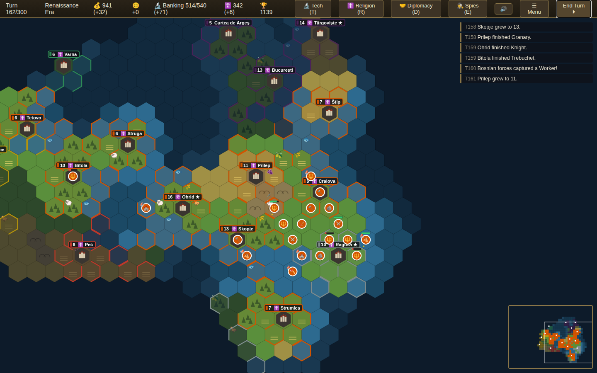

# ⚔ Balkan Civilizations

A local, turn-based 4X strategy game in the spirit of Civilization V, set
entirely in the Balkans — single-player against the AI, **hotseat** on one
device, or **online with friends** over a direct browser-to-browser
connection (no game server, no accounts). Runs 100% in your browser: no
install needed.



## How to play

Just open `index.html` in any modern browser (Chrome, Firefox, Edge, Safari):

- **Double-click `index.html`**, or
- serve the folder locally: `python3 -m http.server 8000` then visit
  <http://localhost:8000>.

**Play it from a URL**: the repository ships a GitHub Actions workflow
(`.github/workflows/deploy-game.yml`) that publishes this folder to GitHub
Pages on every push to `main`. Enable it once under *Settings → Pages →
Source: GitHub Actions*, and the game gets a permanent link you can send
to friends. **Touch is fully supported** — tap to select, tap a highlighted
hex to move, long-press for move orders, drag to pan, pinch to zoom — so
they can join from phones and tablets.

Your game **auto-saves every turn** (browser localStorage) — use *Continue Saved
Game* on the title screen to pick up where you left off. Saves preserve the
exact deterministic random stream, so reloading does not reroll future combat,
events, or AI choices.

## The nine civilizations

| Civilization | Leader | Trait | Unique unit |
|---|---|---|---|
| **Macedonia** | Tsar Samuil | +2 culture, +1 science in every city | **Samuil's Guard** — +25% on defense |
| **Serbia** | Stefan Dušan | +25% production toward buildings | **Gusar** — 5-move light cavalry |
| **Bulgaria** | Simeon I the Great | +2 science in every city | **Konnik** — heavy horseman |
| **Byzantium** | Basil II | +4 gold in capital, +1 elsewhere | **Cataphract** — armoured cavalry |
| **Ottomans** | Mehmed II | +20% strength attacking cities | **Janissary** — heals 50 HP on kill |
| **Albania** | Skanderbeg | +30% strength in hills & forest | **Stradiot** — mountain cavalry |
| **Croatia** | Tomislav | +2 gold, +1 food in coastal cities | **Uskok** — fast raider |
| **Wallachia** | Vlad III Drăculea | +25% strength in own territory | **Călărași** — heals 30 HP on kill |
| **Bosnia** | Tvrtko I | +50% culture (faster borders) | **Krstjani Guard** — elite pikeman |

## Features

- **Multiple leaders per civilization**: each of the nine civs offers
  at least three historical leaders — 29 in all — with distinct traits, chosen on
  the start screen. Play Serbia under Stefan Dušan's builders, Stefan
  Nemanja's culture, or Lazar's stubborn defense; the unique unit stays
  the same, the strategy changes
- **Five eras** of technology, now reaching the **Industrial era**:
  Rifling, Steam Power, and Military Science unlock Riflemen, Cannon,
  Cavalry, and the Ironclad, plus Factories, Hospitals, Stock Exchanges,
  and two new wonders (the Iron Gates Works and the Orient Express)
- **Six ways to win**: conquer every original capital (**Domination**),
  master all 32 technologies (**Scientific**), complete three policy branches
  (**Cultural**), spread your founded religion across every surviving empire
  and over 60% of major cities after six active Missionary spreads against at
  least one rival faith (**Religious**), lead the final standings
  (**Score**), or win a **Diplomatic Victory**. Once a civ researches Civil
  Service, the **World Congress** convenes every few turns to elect a World
  Leader. Delegates come from your empire and, above all, your **city-state
  allies**; win a supermajority of the vote to be elected and win. Click the
  score in the top bar or press `V` for a live overview of all six paths
- **Campaign mode** — *A Thousand Years of the Balkans* strings all ten
  scenarios into one chronological arc from 893 to 1804 AD. Chapters
  unlock in sequence and a running **Glory** score is carried across the
  whole campaign, saved between sessions
- **Civilopedia** (📖 button or `?`): a searchable in-game reference —
  every unit, building, wonder, technology, social policy, promotion,
  belief, city-state type, civilization, and victory condition, with a
  live search box and category tabs. Generated straight from the game's
  data tables, so it always matches the actual rules
- **Advisor tips**: dismissible contextual hints for newcomers that appear
  the first time each situation arises (found your first city, choose
  research, met a rival, a policy is affordable, and so on) — with a
  one-click opt-out
- **Random events**: harvests, migrations, relics, and trade windfalls on
  the upside; plagues, unrest, fires, drought, and brigands on the down —
  each with real mechanical effects and occasional temporary happiness
  swings, so no two games play out the same
- **Accessibility settings** (Menu → ⚙️): a colorblind-friendly civ
  palette, a reduce-motion toggle (stops the animated sea, drifting sun,
  and attack lunges), and an advisor-tips switch — all remembered between
  sessions
- **3D graphics** (default): a WebGL diorama built with Three.js — extruded
  hex terrain with cliff faces, cone mountains with snow caps, stepped
  hills, tree-covered forests, a translucent sea over a depth-shaded
  seabed, and dark "uncharted" prisms hiding the unexplored world. Rotate
  the camera with `Q` / `W`. Switch to the original **Classic 2D** renderer
  any time from the ☰ Menu — the game autosaves and resumes seamlessly,
  and both styles show the exact same match (Three.js is vendored locally,
  so the game still works fully offline)
- **Living city skylines** in both renderers: settlements grow denser with
  population and advance through five architectural eras. Constructed walls,
  religious landmarks, factories, and world wonders visibly change the map,
  while cities outside current vision use a fog-safe redacted silhouette
- **Strategic tile-yield lens** in both renderers: press `Y` or use the
  wheat control to reveal food, production, and gold directly on every
  currently visible hex. The setting persists between sessions and uses
  distinct circle, square, and diamond markers for colour-independent reading
- **Surveyed Settler guidance**: selecting a Settler compares every visible
  site it can reach this turn, marks excellent, promising, and marginal city
  locations, and distinguishes sites that require waiting until next turn to
  found. Hovering a candidate reports its potential and survey coverage
- **City focus and production planning**: every city can prioritize balanced
  output, growth, production, or gold. Citizens claim unique worked tiles,
  highlighted on the map in both graphics modes, while the city panel shows
  exact growth and production forecasts. Purchases and queued projects enforce
  technology, resource, ownership, wonder, and unit-placement rules
- **Empire overview** (`O` or the 🏛️ command): sortable city administration,
  a complete military roster, direct map-jump actions, and an auditable gold
  ledger in one compact screen. City focus can be changed in place, while the
  ledger exposes Golden Age, trade, policy, city-state, tithe, and maintenance
  modifiers from the same forecast used by the turn engine
- **Guarded unit orders**: a tactical unit panel combines health, movement,
  strength, veteran status, and current orders with grouped commands. Every
  player action is checked against ownership and the active turn; cancelling a
  Worker job cannot refund movement, and the only Settler cannot be disbanded
  before a capital exists
- Procedurally generated hex maps with smooth coastlines, different every
  game — choose a rugged **Peninsula**, an island-dotted **Archipelago**,
  or a **custom map** you painted yourself in the built-in **Map Editor**
  (terrain, forests, and resources, saved locally)
- **Hotseat multiplayer**: 2–3 humans share the device — each gets their
  own fog of war, notifications, and a pass-the-device screen between turns
- **Online multiplayer** (up to 4 humans, each with their own civilization):
  serverless WebRTC. The host clicks *Host Online*, sends each friend an
  invite code over any chat app, pastes back their replies, and starts —
  after that the connection is direct between browsers. Each player picks
  their civ on their own start screen, sees only their own fog of war, and
  plays in turn while the others watch a waiting banner
- **Ten campaign scenarios across all nine civilizations**, each with its own
  victory rule and a live objective tracker in the top bar:
  - *The Rise of Samuil* (Macedonia, 976) — take Constantinople in 150 turns
  - *The Golden Age of Simeon* (Bulgaria, 893) — first to master every
    technology, with Byzantium at your door
  - *The Bulgar-Slayer* (Byzantium, 1014) — take Samuil's Ohrid in 100 turns
  - *The Kingdom Crowned* (Croatia, 925) — survive Tsar Simeon's invasion
  - *Dušan's Dream* (Serbia, 1346) — hold three imperial capitals
  - *The Night Attack* (Wallachia, 1462) — destroy 12 Ottoman units as
    Vlad Drăculea, on hard difficulty
  - *Tvrtko's Crown* (Bosnia, 1377) — control six cities, by charter or sword
  - *The Fall of Constantinople* (Ottomans, 1453) — breach the Theodosian
    Walls in 60 turns
  - *Skanderbeg's Rebellion* (Albania, 1443) — hold Krujë for 100 turns,
    on hard difficulty
  - *The Serbian Revolution* (Serbia, 1804) — as Karađorđe, hold Beograd
    and destroy 10 Ottoman units in a fully Industrial opening
- **Social policies** — four Balkan-flavoured branches you unlock with
  accumulated culture: **Zadruga** (the family homestead — growth and land),
  **Junak** (the hero's path — war and glory), **Čaršija** (the bazaar
  quarter — trade and coin), and **Sabor** (the church council — faith and
  art). Each policy costs more than the last; completing every policy in a
  branch grants a powerful finisher. Complete **three branches** to win a
  **Cultural Victory**
- **Deeper diplomacy** between major civs: swap surplus **luxuries** for a
  fixed term (both sides gain happiness), send **gold gifts** to warm a
  rival's attitude, and sign **defensive pacts** with friends — if either
  signatory is attacked, the other joins the war. Every rival tracks an
  attitude toward you, shown on the diplomacy screen
- **Role-aware unit promotions**: every veteran can specialize in attack,
  defense, or field medicine; land troops add Pathfinder and Amphibious
  Assault options, while fleets unlock Boarding Parties, Bombardment, and
  Navigation. Promoted melee troops can attack directly from transports
- **City-state quests**: minors periodically ask a favour — burn a specific
  barbarian camp, slay raiders, or be first to a technology — and reward the
  civ that delivers with a burst of influence
- Naval warfare: research Sailing to embark land units onto the coast and
  build Galleys; Compass opens the deep sea and the ranged War Galleass,
  followed by Gunpowder Frigates and Steam-powered Ironclads. Ships hunt
  transports, bombard shores, and can capture coastal cities;
  embarked units are nearly defenseless — escort them. AI fleets chart unknown
  seas, modernize in home waters, screen transports, and coordinate bombardment.
  A stronger adjacent fleet **blockades** a hostile port, halving city gold,
  suspending endpoint trade routes, and stopping repairs until defending
  warships restore local naval control. AI fleets impose and break these
  blockades as part of their coastal campaigns. Fleets also depend on
  connected supply projected by owned coastal cities: Compass and Steam Power
  extend its reach, while ships that remain beyond coverage exhaust a two-turn
  grace period, then suffer attrition and reduced combat effectiveness. AI
  admirals return endangered ships to port and recover before redeploying
- Fog of war with explored/visible states
- Cities: population growth, worked tiles, culture-driven border expansion,
  production queues, gold purchasing, 16 buildings and 10 world wonders
  (Hagia Sophia, Mount Athos, the Hippodrome, Diocletian's Palace,
  Stari Most, Bran Castle, and more — each buildable once per world)
- 32-technology research tree across five eras (Ancient → Industrial)
- Civ V-style combat: hit points, ranged vs melee, terrain defense bonuses,
  fortification, floating damage numbers, and sieges — cities bombard one
  besieger every turn, so bring catapults. Select a target for a **combat
  forecast** with damage ranges and a risk verdict before confirming the
  strike; a battle report records the outcome, and attacks suffered during
  the AI turn appear in the defender's turn recap. Enemy land melee formations
  control adjacent ground and end movement on entry; visible controlled hexes
  are outlined in amber. Surround a land target with up to two additional
  melee units for a capped **+20% flanking bonus**
- **Barbarians** (optional toggle): camps seed the wilds and spawn raiders
  that scale with the era; burn a camp for a 40-gold bounty. **Ancient
  ruins** reward explorers with gold, faith, science, veteran experience,
  or maps of the surrounding land
- **Unit upgrades**: pay gold in home territory to modernize veterans along
  their line (Warrior → Swordsman → Longswordsman → Musketman, and so on),
  keeping their promotions — unique units included
- Unit promotions: combat earns XP; veterans gain up to three ⭐ levels,
  each worth +5% strength (and a morale heal plus a specialization pick)
- **Religion**: Shrines, Temples and monasteries generate faith. Found one
  of six historical faiths — Orthodoxy, Catholicism, Islam, Bogomilism,
  Tengrism, Hellenism — pick a founder belief (food, science, gold tithe,
  or holy-warrior combat bonus), and spread it: religion flows between
  nearby cities and Missionaries (bought with faith) convert them directly
- **City-states**: independent minors like Ragusa, Kotor and Rhodes.
  Win them over with gold gifts — friends and allies pay gold, food or
  culture, and militaristic allies gift you units — or conquer them, if
  you can breach their walls
- **Happiness & Golden Ages**: your empire's mood (top bar) rises with
  luxuries (wine, silver, olives, salt) and Taverns/Hammams, and falls as
  cities and population grow. Unhappy empires grow at half speed; below −10
  growth stops and units fight at −15%. Surplus happiness fills a meter
  that triggers **Golden Ages**: 10 turns of +20% gold and production
- **Espionage**: spies unlock with Civil Service, Education and Gunpowder.
  Station them in rival cities to steal technology (and risk execution),
  in your own cities as counter-intelligence, or in city-states to rig
  elections for influence
- **Sound & music**: procedurally synthesized effects (WebAudio, no audio
  files) for combat, research, golden ages, spies and more, plus an ambient
  score — a low drone under a wandering melody in the double-harmonic
  "Balkan" scale. Toggle effects (🔊) and music (🎵) separately
- Workers and tile improvements: farms, mines, and roads. Roads coexist with
  productive improvements, cut movement cost to 1, and form visible capital
  networks; each linked city earns population-scaled connection gold. AI
  Workers coordinate deterministic intercity corridors before routine tile jobs
- Strategic resources (horses, iron) gating unit types; luxury resources
  feeding happiness
- 3–8 AI opponents that scout, settle (across the sea, too), improve their
  land, build navies, research, declare war, sue for peace, and march
  armies on your cities
- **Trade routes**: Caravans (Currency) establish gold routes between
  cities — up to 3, richer over distance and to foreign partners — drawn
  on the map and **plunderable** by any hostile army that steps on the road
- **Great People**: libraries and workshops accumulate Scientist and
  Engineer points, battlefield kills earn General points. Great Scientists
  finish a technology, Great Engineers rush 300 production, Great Generals
  radiate +15% combat strength within 2 tiles — all with historical
  Balkan names (yes, Tesla is in there)
- **Game speed** (Quick / Standard / Epic) scales research pace and game
  length; **Mirror** world type gives fair symmetric maps for multiplayer
- **Goal-aware AI strategy**: leaders derive a preferred victory route from
  their traits, then align research, buildings, policy branches, missionaries,
  city-state gifts, trade routes, and army composition with that plan. War
  targets are scored by distance, attitude, allied fronts, and relative power;
  armies share a campaign objective, reserve separate assault positions, and
  maintain frontline, ranged, and siege support. Settlers get escorts, melee
  waits for bombardment to breach walls, and gold modernizes veterans. Island
  empires prepare Compass and an expedition fleet before opening overseas wars
- Cities support a **production queue** (queue up to 6 items) and a full
  clickable **message log**; wounded units can fortify until healed
- **Undo** a simple move (before anything eventful happens); **3 manual
  save slots** plus **export/import of save files** — email a save to a
  friend to continue an online match later
- An **end-game replay graph** charts every civilization's score across
  the whole game
- Diplomacy screen: declare war, propose peace, compare scores
- Three difficulty levels (Prince / King / Emperor) scaling AI output
- Hover any hex for a movement path preview with turn count; scouts can
  **auto-explore**; units glide between hexes instead of teleporting
- Six standard victory routes with live progress and known-rival standings
- Autosave + continue

## Controls

| Input | Action |
|---|---|
| Left-click | Select unit / city; click highlighted hex to move or attack |
| Right-click | Move selected unit |
| Drag | Pan the map |
| Mouse wheel | Zoom |
| `Q` / `W` | Rotate the camera (3D mode) |
| `Y` | Toggle the tile-yield lens |
| `Enter` | End turn |
| `N` / `.` | Next idle unit |
| `F` | Fortify selected unit |
| `O` | Empire overview: cities, military, and economy |
| `T` | Technology tree |
| `P` | Social policies |
| `?` | Civilopedia (searchable reference) |
| `R` | Religion overview |
| `E` | Espionage |
| `D` | Diplomacy |
| `Esc` | Close panels |

## Code layout

Plain HTML/CSS/JavaScript — no frameworks, no build step.

```
index.html        page shell
css/style.css     all styling
js/data.js        civs, units, buildings, techs, terrain tables
js/cityart.js     shared era, population, and landmark city visuals
js/sound.js       procedural WebAudio sound effects
js/hex.js         hex-grid math (odd-r offset, cube distance, pixel transforms)
js/mapgen.js      seeded value-noise map generation + start placement
js/model.js       game engine: cities, units, combat, research, turns, save/load
js/ai.js          AI: settling, production, research, diplomacy, tactics
js/unitart.js     shared code-native unit silhouettes for both map renderers
js/render.js      classic 2D canvas renderer + minimap
js/render3d.js    3D WebGL renderer (extruded hex terrain, sprite units)
js/vendor/        three.min.js (r147, vendored so the game works offline)
js/editor.js      map editor
js/net.js         serverless WebRTC multiplayer (invite codes, state relay)
js/ui.js          panels, modals, input handling
```

Run the deterministic gameplay, balance, save-state, and AI regressions with:

```sh
node --test tests/*.test.mjs
```

## Performance

The 3D renderer rebuilds terrain geometry only when the map changes and
re-meshes fog, borders, and improvements only when their state changes, so
steady-state frames stay flat regardless of map size. Benchmarked in
Chromium, steady frames render in **2–5 ms** from the Standard map all the
way up to an 84×64 grid (over 3× the Large map, ~54k triangles); the
one-time geometry build stays around 140 ms even at that size. The
**Reduce motion** setting disables the ambient water/sun animation for
slower devices.

## Notes on online play

The invite/reply codes are standard WebRTC session descriptions — exchange
them over any messenger. A STUN server (Google's public one) is used for
NAT traversal; on very restrictive networks a direct connection may fail.
The full game state is auto-saved locally on every turn, so if a connection
drops mid-game the host can continue against the AI or re-host later.

## Ideas for future expansion

Longer historical campaign chains, further Industrial-era scenarios, and
localized interface text.
